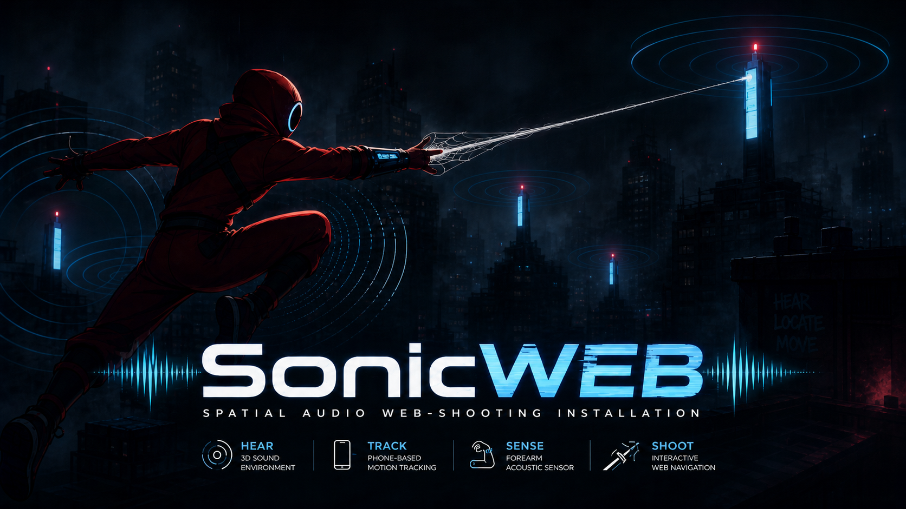
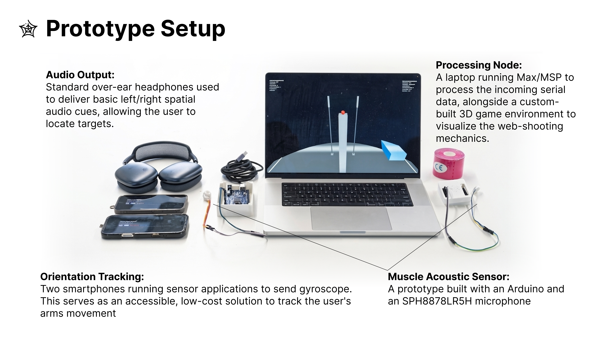
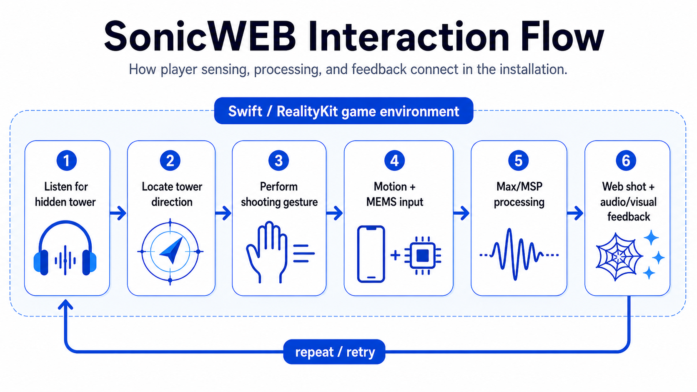

# SonicWEB

**Spatial Audio Web-shooting Installation**  
An interactive installation where players locate hidden sound towers through spatial audio and trigger web-shooting actions through body movement and sensor input.

---

## At a Glance

SonicWEB explores one core idea:

> What if web-shooting in a game felt like a physical action, not a button press?

The prototype combines:

- **Spatial audio** for locating hidden sound towers
- **Phone motion tracking** for arm / body orientation
- **MEMS microphone sensing** for physical shooting input
- **Max/MSP** for signal processing
- **Swift / RealityKit** for the playable game environment



---

## Demo

- [Demo Video](https://youtu.be/IUAQwB5XmB0?si=1B07zf2wra-cwMkN)
- [Project Slides](https://drive.google.com/file/d/1JQ_CTyRrqrwFQBj97AdEP0MOvPRhRGQ0/view?usp=sharing)

---

## How It Works

Players wear headphones and listen for hidden sound towers in a dark city-like game environment.

Instead of relying mainly on visual markers, the player uses spatial audio cues to locate the next tower direction. Once aligned, they perform a web-shooting gesture.

Motion data and MEMS microphone input are processed into a shooting trigger. The Swift / RealityKit game then responds with web visuals and spatial audio feedback, telling the player whether the shot succeeds or needs to be retried.



The core loop is:

1. Listen for the hidden tower.
2. Locate the tower direction through spatial audio.
3. Perform a shooting gesture.
4. Motion and MEMS input are processed.
5. Max/MSP converts the signal into a usable trigger.
6. The game fires a web shot and gives audio-visual feedback.
7. The player repeats the loop or retries.

---

## What This Repository Shows

This repository focuses on the Swift-side game and feedback layer of the installation.

It demonstrates:

- Swift-based interactive prototyping
- RealityKit visual feedback
- AVFoundation spatial audio
- UDP input communication
- real-time audio-visual interaction
- hardware-software integration

The main challenge was making sound, movement, sensing, and gameplay feel like one coherent interaction loop.

---

## My Contribution

This was a team installation project. My main contribution focused on the Swift application layer and the interaction experience.

I worked on:

- spatial audio navigation behaviour
- sound tower feedback
- IMU / motion input integration
- web-shooting feedback
- Swift / RealityKit game interaction
- tuning the audio-visual feedback loop

My role was to connect sensing, sound, and gameplay into a playable real-time experience.

---

## Tech Stack

- **Swift**
- **RealityKit**
- **AVFoundation**
- **UDP networking**
- **Max/MSP**
- **Smartphone IMU tracking**
- **Arduino + MEMS microphone sensor**

---

## Running the Project

1. Clone the repository:

```bash
git clone https://github.com/chihyinwang/AXD-Installation.git
```

2. Open the project in Xcode.

3. Build and run the main target.

4. If you have the full sensor setup, run the external motion / signal processing pipeline.

5. Without the MEMS sensor setup, you can still test the game using keyboard input:

   - Press **`Q`** to shoot left
   - Press **`E`** to shoot right

6. Headphones are strongly recommended, as the experience relies on spatial audio cues.

